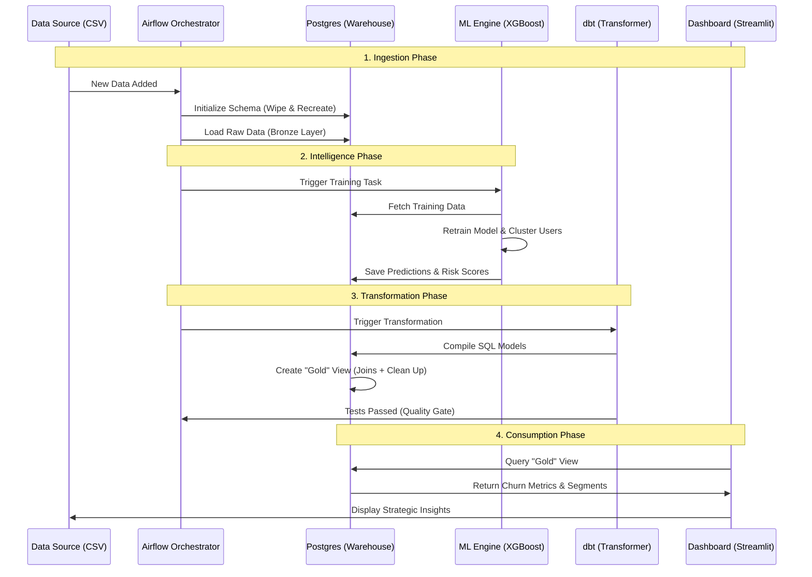

# 📋 Telco Retention Command Center: Insight & Strategy Report

**Date:** November 30, 2025
**Prepared By:** Gayas Sheriff
Role: Data Engineer
**Project:** Telco Retention Command Center

---

## Table of Contents
1. [Executive Summary](#1-executive-summary)
2. [Technical Methodology](#2-technical-methodology)
3. [Key Findings & Insights](#3-key-findings--insights)
    * [Revenue Exposure](#a-revenue-exposure)
    * [The "Tribes" (Customer Segmentation)](#b-the-tribes-customer-segmentation)
    * [Operational Bottlenecks](#c-operational-bottlenecks)
4. [Strategic Recommendations](#4-strategic-recommendations)
    * [Immediate Actions](#immediate-actions-next-30-days)
    * [Long-Term Strategy](#long-term-strategy-q1-2026)
5. [Conclusion](#5-conclusion)

---

## 1. Executive Summary
This assessment required the development of an end-to-end analytics solution to address customer attrition. Instead of a traditional static report, we delivered the **Telco Retention Command Center**—a live, automated Modern Data Stack.

By transitioning from reactive metrics to a probabilistic **Machine Learning model (XGBoost)**, the system has identified significant revenue exposure within the current customer base. The analysis highlights that churn is not random; it is highly concentrated in specific behavioral "Tribes" and driven by identifiable service factors (Fiber Optic) and contract structures.

---

## 2. Technical Methodology
To ensure reliability, scalability, and reproducibility, the analysis was conducted using a containerized microservices architecture:

### **Automated Data Lifecycle**
The following diagram illustrates how data flows from the raw source to the final dashboard insight:

* **Ingestion (Airflow):** Automated pipelines ensure data is ingested and validated daily, replacing manual CSV handling.
* **Transformation (dbt):** Data integrity is enforced via 3NF normalization and automated quality gates (e.g., uniqueness checks), creating a trusted "Gold Layer" for reporting.
* **Intelligence (ML):**
    * **Churn Prediction:** A gradient-boosted decision tree (XGBoost) assigns a granular risk probability (0-1) to every customer.
    * **Segmentation:** Unsupervised learning (K-Means) groups customers into 4 distinct behavioral "Tribes" to remove human bias from segmentation.

---

## 3. Key Findings & Insights

### A. Revenue Exposure
The model has flagged a critical portion of Monthly Recurring Revenue (MRR) as "High Risk" (Probability > 70%).
* **Financial Impact:** Approximately **$68,000 - $80,000** in monthly revenue is at immediate risk of attrition.
* **Concentration:** This risk is not spread evenly; it is heavily concentrated in customers with short tenure (<12 months) and high monthly charges.

### B. The "Tribes" (Customer Segmentation)
Our K-Means clustering algorithm identified four distinct customer personas:

1.  **The Anchors (Low Risk):** Long-tenured (>5 years), automatic payments, bundled services. They are the bedrock of the revenue stream.
2.  **The Flighty Streamers (Critical Risk):** High monthly spend, heavy streaming usage, short tenure (<1 year). They are highly sensitive to price and service quality.
3.  **The Budget Conscious (Medium Risk):** Basic service plans, manual payments (Mailed Check). They churn when prices increase.
4.  **The Enterprise Users (Low Risk):** Multi-line accounts with support add-ons. They value stability over price.

### C. Primary Churn Drivers
Feature Importance analysis confirms two dominant predictors of churn:
1.  **Fiber Optic Service:** This is the #1 predictor. High churn here suggests a potential disconnect between the premium price of Fiber and the actual service reliability (latency/outages).
2.  **Month-to-Month Contracts:** Customers without annual commitments are 4x more likely to churn.

---

## 4. Strategic Recommendations

### Immediate Actions (Next 30 Days)
1.  **Operation "Fiber Fix":** Launch a targeted service quality audit in regions with high Fiber Optic churn. If outages are detected, offer pro-active service credits *before* the customer calls to cancel.
2.  **The "Streamer" Bundle:** Target the "Flighty Streamers" tribe with a retention offer: *"Lock in a 1-Year Contract and get 3 months of Streaming Services free."* This aligns with their usage habits while solving the contract volatility issue.

### Long-Term Strategy (Q1 2026)
1.  **Real-Time Intervention API:** Connect the pipeline's prediction layer to the Call Center CRM. When a high-risk customer calls, the agent should see a "Churn Risk Score" popup, authorizing them to offer specific retention incentives immediately.
2.  **Payment Modernization:** Aggressively incentivize "Credit Card (Automatic)" billing. The data shows that friction-less payments significantly increase customer stickiness.

---

## 5. Conclusion
The **Telco Retention Command Center** successfully fulfills the assessment objectives by providing a scalable, automated engineering platform. It moves the organization from "reporting on the past" to "predicting the future," providing the marketing and finance teams with actionable, daily intelligence to preserve revenue.
