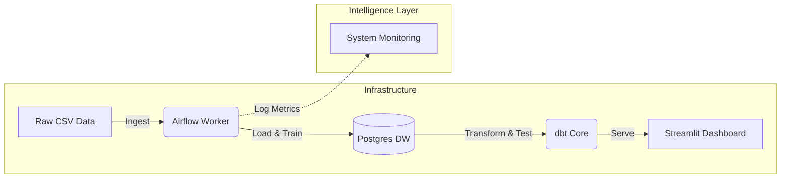
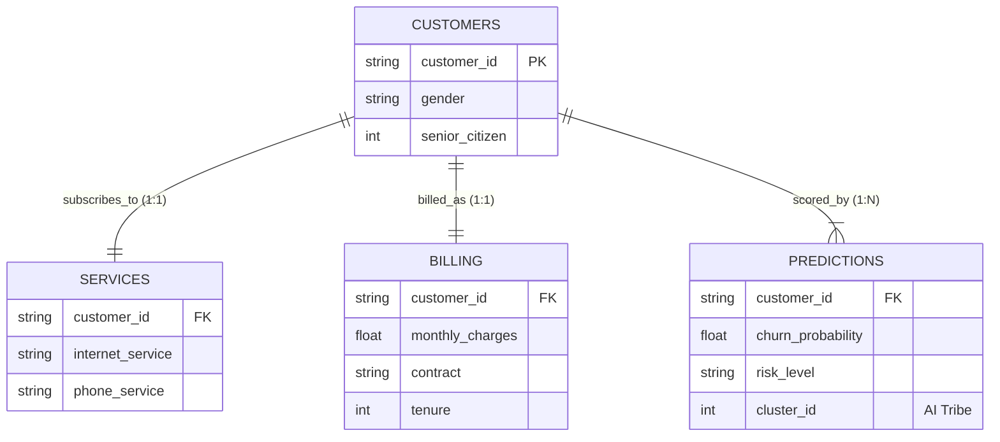
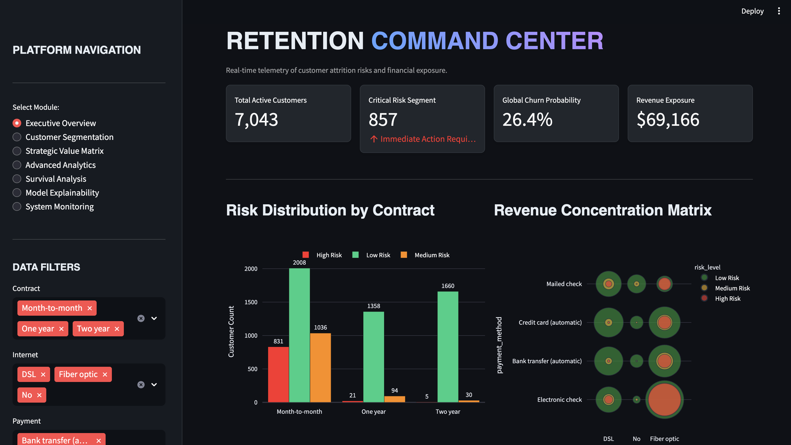
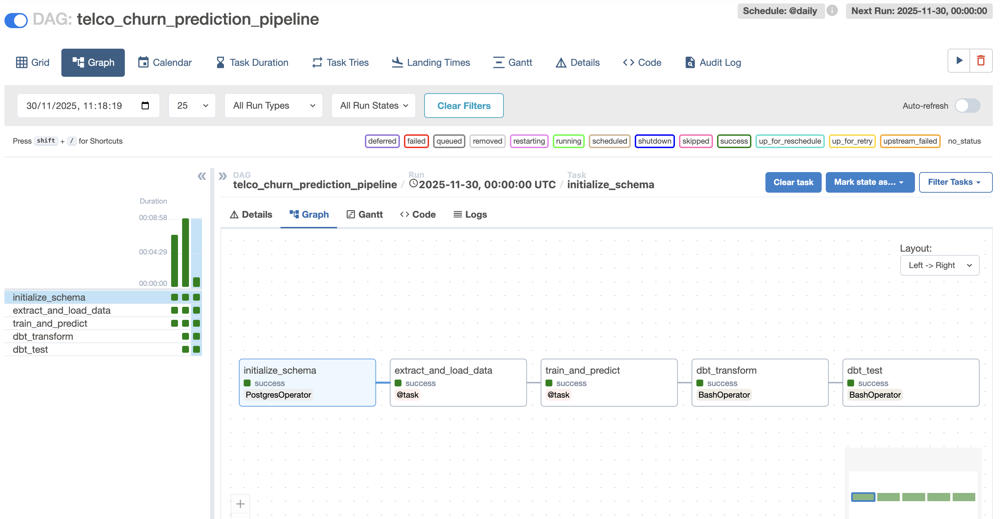

# Telco Retention Command Center


> **A production-grade Data Engineering platform that moves beyond static reporting to predictive, automated retention intelligence.**

---

## **1. Project Overview**
This project upgrades traditional Telco Churn analysis into a **Modern Data Stack**. Instead of manual scripts, it uses a containerized microservices architecture to ingest, clean, model, and visualize data automatically.

### **Key Capabilities**
* **Self-Healing Pipelines:** Airflow DAGs handle retries and dependencies automatically.
* **Data Quality Gates:** dbt tests ensure no duplicate customers or null charges enter the Gold Layer.
* **Advanced ML Integration:** Combines **XGBoost** (Churn Prediction) with **K-Means Clustering** (Customer Segmentation) to identify *who* is leaving and *why*.
* **Idempotency:** The entire pipeline can be re-run safely without creating duplicate data.

---

## **2. System Architecture**

The platform follows a decoupled microservices pattern orchestrated by Docker.



| Service | Technology | Purpose |
| :--- | :--- | :--- |
| **Orchestrator** | Apache Airflow 2.7 | Manages the DAG (Init $\to$ ETL $\to$ ML $\to$ dbt). |
| **Warehouse** | PostgreSQL 15 | Stores Raw Data (Bronze) and modeled Views (Gold). |
| **Transformation** | dbt (Data Build Tool) | Manages SQL logic, testing, and data lineage. |
| **Dashboard** | Streamlit | Visualizes High Risk segments and LTV projections. |

## **3. Data Model (3NF Schema)**
The database is normalized to Third Normal Form (3NF) to ensure integrity, then denormalized via dbt for analytics.



---

## **4. Project Gallery**

### **The Command Center (Dashboard)**
*Real-time intelligence on customer churn risk and revenue exposure.*



### **Orchestration (Airflow)**
*The automated DAG handling ETL, ML Training, and dbt Transformations.*



---

## **5. How to Run (Cross-Platform)**

This project is fully containerized using Docker, ensuring it runs identically on macOS, Windows, and Linux.

### **Prerequisites**
* **Docker Desktop** installed and running.
* **Git** (Optional, for cloning).

### **Option 1: macOS / Linux (Terminal)**
1.  **Navigate to the project folder:**
    ```bash
    cd Telco-Pro-Engine
    ```
2.  **Launch the Platform:**
    ```bash
    docker-compose up --build -d
    ```
3.  **Verify Running Containers:**
    ```bash
    docker ps
    ```

### **Option 2: Windows (PowerShell)**
1.  **Open PowerShell** as Administrator.
2.  **Navigate to the project folder:**
    ```powershell
    cd \path\to\Telco-Pro-Engine
    ```
3.  **Launch the Platform:**
    ```powershell
    docker-compose up --build -d
    ```
    *(Note: Ensure Docker Desktop is configured to use the WSL 2 backend).*


---

## **6. Accessing the Interfaces**
Once the containers are running (Status: `Up`):

1.  **Orchestrator (Airflow):** [http://localhost:8080](http://localhost:8080)
    * *Credentials:* `airflow` / `airflow`
    * *Action:* Toggle the **ON** switch for `telco_churn_prediction_pipeline`.
    * *Monitor:* Watch the tasks turn Dark Green (Success).

2.  **Command Center (Streamlit):** [http://localhost:8501](http://localhost:8501)
    * *Action:* View real-time churn metrics, segmentation, and 3D customer plots.

---

## **7. Logic & Models**

### **Data Engineering (ETL)**
* **Extract:** Reads raw CSV data.
* **Load:** Normalizes data into 3NF tables (`customers`, `services`, `billing`) in Postgres.
* **Transform (dbt):** Creates the `analytics_master_view` (Gold Layer) joining all tables and enforcing schemas.

### **Machine Learning**
* **Churn Prediction:** XGBoost Classifier trained on 20+ features.
* **Segmentation:** K-Means Unsupervised Learning clusters customers into 4 behavioral "Tribes."
* **Explainability:** Feature Importance logging to identify key churn drivers (e.g., Fiber Optic, Month-to-Month contracts).

### **Data Quality**
* **Uniqueness:** dbt tests ensure `customer_id` is unique.
* **Completeness:** Pipeline validates critical fields (`TotalCharges`) are not null.

---

## ⚡ **8. Data Lifecycle & Latency**

* **Schedule:** The pipeline runs automatically once every 24 hours (`@daily` in Airflow).
* **Latency:** New data added to the CSV will appear in the dashboard after the next scheduled run (or upon manual trigger).
* **Strategy:** The system uses a **Full Refresh** pattern—tables are rebuilt daily to ensure 100% consistency with the source file.

